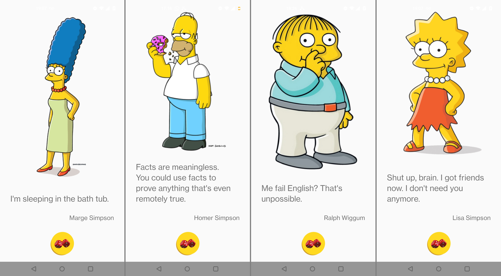

---

## Overview

> "I'm not a bad guy! I work hard, and I love my kids. So why should I spend half my Sunday hearing about how I'm going to Hell?" — Homer J. Simpson

Welcome to **The Simpsons Quote App**, an Android application that randomly displays 50 humorous and iconic quotes from your favorite Springfield residents—complete with character names and images! 

---

## Features

- 50 iconic quotes from *The Simpsons*  
- Character images and names for each quote  
- Random quote generator  
- Simple, clean, and fun UI  

---

## Installation & Usage 

- Clone repo:
   ```bash
   git clone https://github.com/yourusername/simpsons-quote-app.git

   ```
- Open in Android Studio.
- Build & run on your emulator.

## Installation & Usage (if using an Android device)

- Load project with Android Studio. 
- On Android Studio, download Google USB Driver from Android Studio's SDK tools. Then, download and install the OEM Driver that corresponds to your phone https://developer.android.com/studio/run/oem-usb
- On your phone, enable developer mode (e.g., System settings -> About device -> Version -> Build number (tap 7 times)). Next, enable usb debugging (e.g., System settings -> Developer options -> USB debugging). Finally, plug your phone into a USB port that is not an SSUSB. The device should show up in Device Manager.
- Important: Let Android Studio load completely before plugging the USB cable.

---

## Screenshots

|  | 
|:--:| 
| *Examples* |


---

## Data Attribution

This app uses quotes and character data provided by the amazing [TheSimpsonsQuoteAPI](https://github.com/JLuboff/TheSimpsonsQuoteAPI). A huge thanks to them for compiling some of the best moments from Springfield!

To reduce latency, the quotes are stored locally in the app as a JSON file. 
